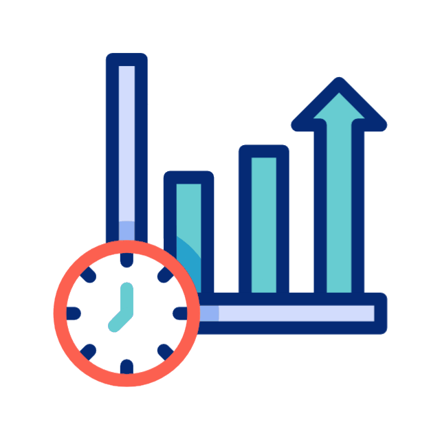

# Sobre mi / About Me 

ES 🇪🇸

Soy un desarrollador de software autodidacta, con un fuerte entusiasmo por el aprendizaje continuo. 
Me encanta romper cosas para entender su funcionamiento y luego reconstruirlas con una visión más optimizada. 
Siempre estoy en búsqueda de nuevos retos y tecnologías, convencido de que la mejor forma de aprender es creando, probando y equivocándome. 
Actualmente estoy construyendo mi camino para convertirme en Full Stack Developer, enfocándome en desarrollar bases sólidas en el backend y en una formación integral dentro del ecosistema del desarrollo

 

 

EN 🇺🇸

I am a self-taught software developer, with a strong enthusiasm for continuous learning. 
I love breaking things to understand how they work, and then rebuilding them with a more optimized vision. 
I am always in search of new challenges and technologies, convinced that the best way to learn is by creating, testing, and learning from mistakes. 
Currently, I am building my path to become a Full Stack Developer, focusing on developing solid foundations in the backend and on gaining a comprehensive education within the software development ecosystem.

# <h2>Lenguajes  </h2>

        

# <h2>Estadisticas: 
</h2>

    
 

 

